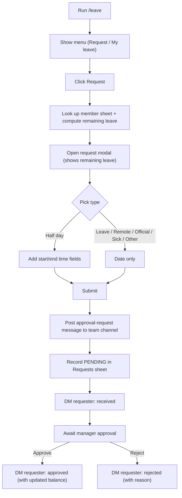
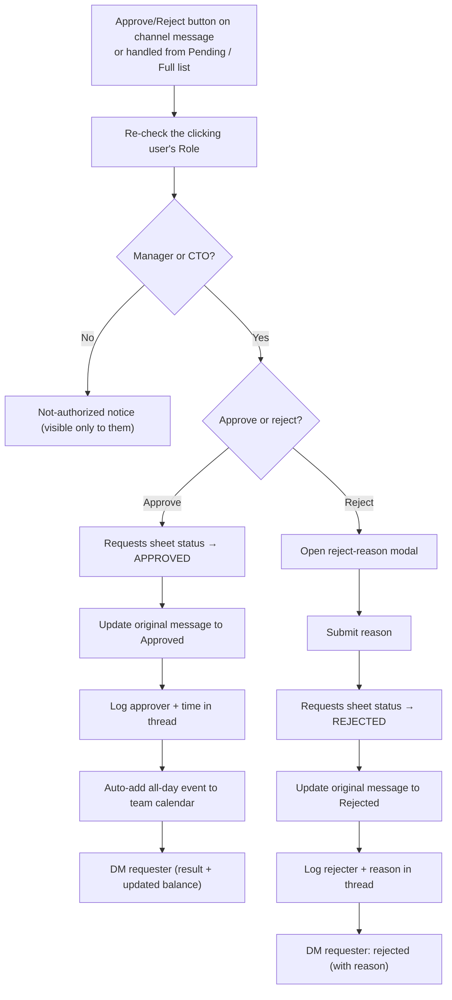
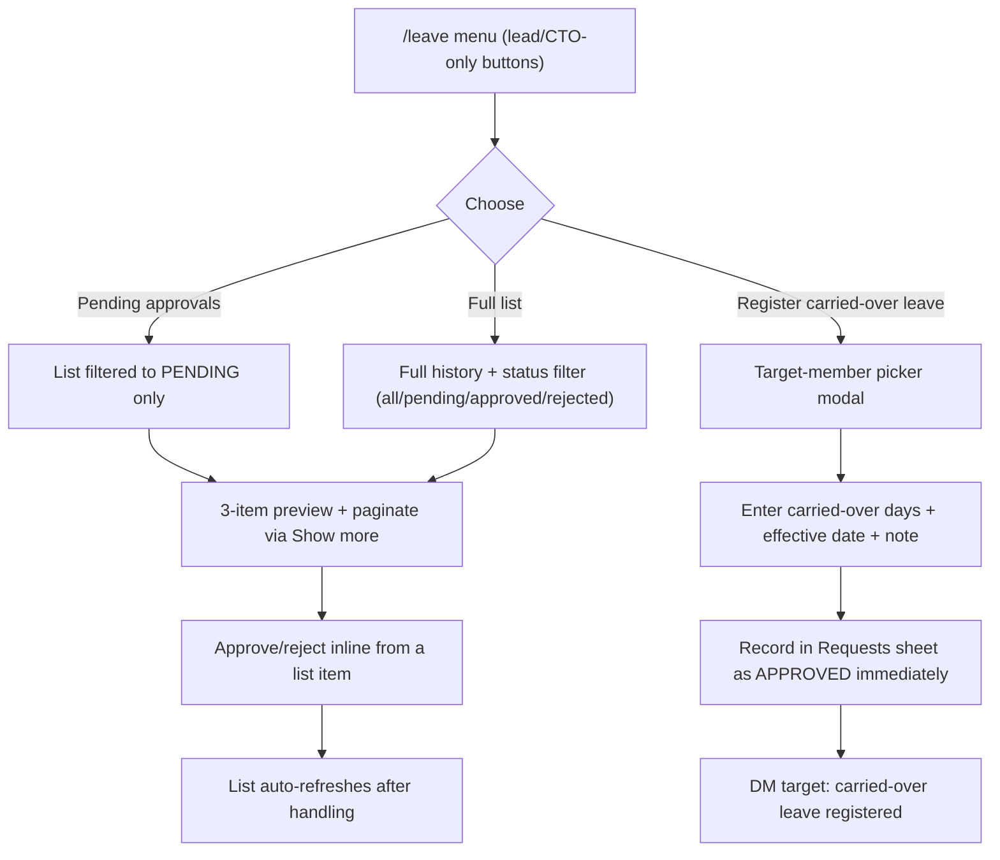

## The problem: approving leave is more of a chore than you'd think

Something I only learned after becoming a team lead: to the person requesting it, leave is a quick "I'll take a day off" — but to the person approving it, it's something you have to keep tracking. Who requested what and when, how many unhandled requests are piling up, how many days each teammate has burned this month, whether I approved something but forgot to put it on the calendar. Manage all that on DMs and memory alone and you _will_ drop one eventually.

So this time I designed for the **manager experience** first, not just the requester's. On top of the primary request/approval flow, I built a pending-approvals list only leads and the CTO can see, a team-wide leave overview, and a manager-only registration feature for carrying over historical data. The goal was to make it so that "from request to approval to team-calendar entry, everything happens inside Slack, and the manager never has to track anything separately." The backend runs on n8n.

## Why a slash command + menu + modal

At first I considered taking everything as command arguments, like `/leave request 8/15`. But parsing free text for whether it's a half day or a full day, when it starts and ends, and whether there's a note means the user has to memorize the syntax. So I let the command be **just an entry point** and pushed the entire flow after it onto buttons and modals.

Type `/leave` and a menu pops up right there. The buttons in that menu depend on who ran it. A regular teammate sees only "Request" and "My leave," while someone with team-lead or CTO privileges — that is, me — gets extra buttons: "Pending approvals," "Full list," and "Register carried-over leave." That permission check isn't hardcoded — it's decided by looking up the Role value in the member info on the team spreadsheet at request time. When a lead changes or a new manager is added, you just edit the sheet.

## Architecture: I split the router from the domain handlers

This bot wasn't the only one — several other Slack-based automations were already running internally. So instead of building a separate "endpoint that receives Slack interactions (button clicks, modal submissions)" for each workflow, I routed everything through **a single central router**.

```plain
Slack Interactivity Webhook (single endpoint)
        │
        ▼
   parse payload
        │
        ▼
  Switch (action_id / callback_id pattern match)
        │
   ┌────┼────────────┬───────────────┐
   ▼    ▼            ▼               ▼
 Leave  PR review   Messaging    (other features)
handler  handler     handler
(calls each domain workflow via Execute Workflow)
```

The router does exactly two things. It parses the Slack payload, and it looks at the action_id/callback_id pattern (prefix and suffix matching included) to decide which domain to hand off to. There's no actual logic in it at all. Splitting it this way paid off clearly:

- In the Slack app settings, there's only one Interactivity endpoint to manage.
- The domain handler workflows are fully independent of each other, so fixing the leave logic can't accidentally break another feature.
- Adding a new feature is just one more branch in the router plus a new handler workflow.

## The requester flow

I kept the flow a regular teammate goes through simple. The modal shows remaining leave first, collects only the inputs the chosen type needs, and that's it on submit. From there, all they do is wait for manager approval.



Here's the leave-day entitlement logic:

```js
// Under 1 year of tenure: prorated monthly (max 11 days)
// After that: 15 days base + 1 day every 2 years (max 25 days)
function calcEntitlement(joinedAt) {
  const years = Math.floor((now - joinedAt) / (365.25 * DAY));
  if (years < 1) return Math.min(monthsSinceJoin, 11);
  return Math.min(15 + Math.floor((years - 1) / 2), 25);
}
```

## The approver (manager) flow

This is the part I sweated over most as a team lead. Approving or rejecting can be done straight from the buttons on the channel message, or from the "Pending approvals" list in the `/leave` menu. Whichever path you come in through, internally it goes through the same permission check and the same post-processing.



The permission check runs again on every single approve/reject click. It never caches or stores in a session the fact that someone was once confirmed as an approver. Whether you act from the list or from the channel message, there's no way to slip past this check — that's the heart of the structure.

## Manager-only features: the part a lead actually uses every day

Beyond handling requests and approvals one at a time, I built separate features for taking in the whole team at a glance. Without these, I'd have ended up opening the spreadsheet again and eyeballing it.



- **Pending approvals / Full list** — no need to scroll the channel hunting for unhandled items. The per-status filter makes things like "let me re-check just this month's rejections" instant. Approving or rejecting from the list reuses the exact approval logic of the original channel message, so even with two handling paths the result always converges to one.
- **Register carried-over leave** — a lead-only feature. When the year rolls over, or when migrating leave data that used to be tracked elsewhere, you can pick a specific teammate and manually enter carried-over days. It's recorded as `APPROVED` immediately, reflected in the balance right away, and the target gets a DM about the registration. The point is that instead of "a manager quietly editing the sheet," there's always a trace left for the person involved.

## A problem I hit: half-day calendar titles came out wrong

One issue I found after building it. Requesting a half day sometimes produced an awkward calendar event title. Digging in, the root cause was that the "exact start and end times" never came through cleanly as parameters in the first place. Toggling fields on and off within a single modal depending on the type was convenient at the request stage, but it meant the post-processing stage had to re-parse "is this a half day, and from what time to what time?" all over again.

Here's the improvement I'm considering. Split the buttons and action_ids by type from the start, so pressing "Request half day" opens a half-day-specific modal and "Remote work" opens a remote-specific one. Meanwhile the post-processing logic (approval, calendar entry, balance deduction) gets bundled and reused in common. The original "pick a type → one modal" design came from the simplicity of solving everything in a single screen — but that simplicity transferred straight into complexity at the post-processing stage. It reconfirmed that simplicity at the input stage and clarity at the post-processing stage are often a trade-off.

## Wrapping up

With no separate backend server or database, I was able to build a workflow with an approval gate, dynamic modals, and calendar sync using nothing but n8n and a spreadsheet. This project showed me that the complexity a low-code tool can handle is far greater than I'd assumed. As a team lead, the part I'm actually happiest with isn't the request flow — it's the manager-only features. I've stopped missing pending approvals, and I almost never open the sheet just to check the team's leave status anymore. The next time I build a similar internal bot, I'll start by applying the pattern I found this time: split actions by type and share the post-processing.
