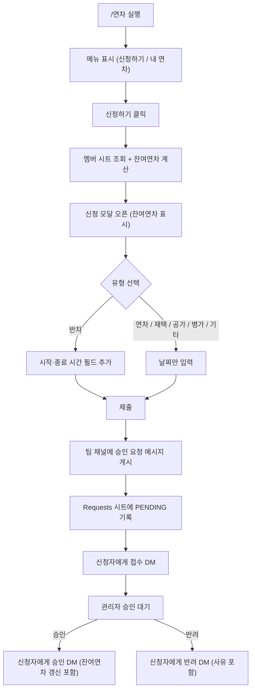
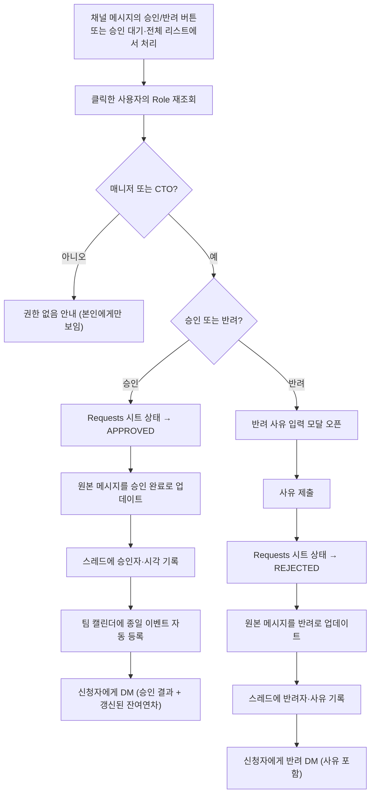
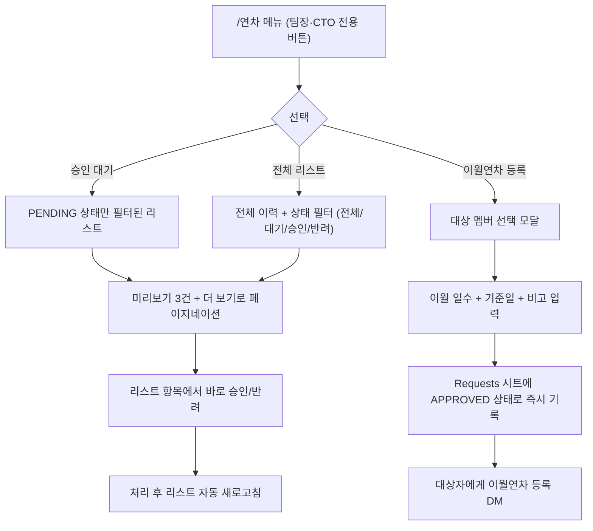

## 문제: 팀장 입장에서 연차 승인은 생각보다 번거로운 일이다

팀장이 되고 나서 알게 된 게 있다. 연차는 신청하는 사람 입장에서는 "하루 쉬겠다"는 짧은 의사표시지만, 승인하는 사람 입장에서는 계속 추적해야 하는 일이다. 누가 언제 신청했는지, 아직 처리 안 한 건이 몇 개나 쌓여 있는지, 이번 달에 팀원이 며칠씩 썼는지, 승인은 했는데 캘린더에 반영을 깜빡한 건 없는지 — 이런 걸 DM과 메모리에만 의존해서 관리하다 보면 반드시 하나씩 놓친다.

그래서 이번엔 신청자 경험뿐 아니라 **관리자 경험**을 먼저 놓고 설계했다. 신청·승인이라는 1차 흐름은 물론이고, 팀장/CTO만 볼 수 있는 승인 대기 목록, 팀 전체 연차 현황, 그리고 과거 데이터를 이월시키는 관리자 전용 등록 기능까지 함께 만들었다. 목표는 "연차 신청부터 승인, 팀 캘린더 등록까지 전부 Slack 안에서, 관리자가 따로 추적하지 않아도 되게" 만드는 것이었다. 백엔드는 n8n으로 짰다.

## 왜 슬래시 커맨드 + 메뉴 + 모달인가

처음엔 `/연차 신청 8/15`처럼 커맨드 인자로 다 받는 방식도 고민했다. 하지만 반차인지 종일인지, 시작·종료일이 언제인지, 비고를 적을지까지 텍스트 파싱으로 받으려면 사용자가 문법을 외워야 한다. 그래서 커맨드는 **진입점 역할만** 하게 하고, 이후 흐름은 전부 버튼과 모달로 넘겼다.

`/연차`를 치면 그 자리에서 바로 메뉴가 뜬다. 메뉴에 뜨는 버튼은 누가 실행했는지에 따라 다르다. 일반 팀원에게는 "신청하기"와 "내 연차"만 보이고, 팀장·CTO 권한을 가진 사람 — 즉 나 — 에게는 "승인 대기", "전체 리스트", "이월연차 등록" 버튼이 추가로 붙는다. 이 권한 판단은 코드에 하드코딩하지 않고, 팀 스프레드시트에 있는 멤버 정보의 Role 값을 그때그때 조회해서 결정한다. 팀장이 바뀌거나 새로운 관리자가 생기면 시트 값만 고치면 된다.

## 아키텍처: 라우터와 도메인 핸들러를 분리했다

이 봇 하나만 있는 게 아니라 사내에는 다른 Slack 기반 자동화들도 여러 개 돌고 있었다. 그래서 "Slack 인터랙션(버튼 클릭, 모달 제출)을 받는 엔드포인트"를 워크플로우마다 따로 만들지 않고, **하나의 중앙 라우터**로 모으는 구조를 택했다.

```
Slack Interactivity Webhook (단일 엔드포인트)
        │
        ▼
   payload 파싱
        │
        ▼
  Switch (action_id / callback_id 패턴 매칭)
        │
   ┌────┼────────────┬───────────────┐
   ▼    ▼            ▼               ▼
 연차   PR 리뷰봇   메시징 봇     (그 외 기능들)
 핸들러  핸들러      핸들러
(Execute Workflow로 각 도메인 워크플로우 호출)
```

라우터는 딱 두 가지 일만 한다. Slack payload를 파싱하고, action_id/callback_id 패턴(접두사·접미사 매칭 포함)을 보고 어느 도메인으로 보낼지 결정한다. 실제 로직은 전혀 없다. 이렇게 나누니 얻는 게 명확했다.

- Slack 앱 설정에서 Interactivity 엔드포인트를 하나만 관리하면 된다.
- 도메인 핸들러 워크플로우는 서로 완전히 독립적이라, 연차 로직을 고치다가 다른 기능을 건드릴 위험이 없다.
- 새 기능을 추가할 때는 라우터에 분기 하나 추가하고, 새 핸들러 워크플로우를 붙이면 끝이다.

## 신청자 플로우

일반 팀원이 겪는 흐름은 단순하게 유지했다. 모달에서 잔여연차를 먼저 보여주고, 유형에 따라 필요한 입력만 추가로 받고, 제출하면 끝이다. 그 뒤부터는 관리자 승인을 기다리는 것뿐이다.



연차 일수 계산 로직은 이렇다.

```js
// 입사 1년 미만: 월 단위로 비례 지급 (최대 11일)
// 이후: 15일 기본 + 2년마다 1일 가산 (최대 25일)
function calcEntitlement(joinedAt) {
  const years = Math.floor((now - joinedAt) / (365.25 * DAY));
  if (years < 1) return Math.min(monthsSinceJoin, 11);
  return Math.min(15 + Math.floor((years - 1) / 2), 25);
}
```

## 승인자(관리자) 플로우

여기가 팀장 입장에서 가장 신경 써서 만든 부분이다. 승인/반려는 채널에 올라온 메시지의 버튼을 바로 눌러도 되고, `/연차` 메뉴의 "승인 대기" 리스트에서 처리해도 된다. 어느 경로로 들어오든 내부적으로는 같은 권한 검사와 같은 후처리를 거친다.



권한 검사는 승인/반려 버튼을 누를 때마다 매번 다시 한다. 한 번 승인 권한을 확인했다고 캐싱하거나 세션에 남기지 않는다. 리스트에서 처리하든 채널 메시지에서 처리하든 이 검사를 피해갈 방법이 없게 만든 것이 이 구조의 핵심이다.

## 관리자 전용 기능: 팀장이 실제로 매일 쓰는 부분

신청·승인 한 건 한 건을 처리하는 것 말고, 팀 전체를 조망하는 기능도 따로 만들었다. 이게 없었으면 결국 다시 스프레드시트를 열어서 눈으로 훑어봤을 거다.



- **승인 대기 / 전체 리스트** — 채널을 스크롤하며 처리 안 된 건을 찾을 필요가 없다. 상태별 필터가 있어서 "이번 달 반려 건만 다시 보자" 같은 것도 바로 된다. 리스트에서 승인/반려를 누르면 원본 채널 메시지의 승인 로직을 그대로 재사용하도록 만들어서, 처리 경로가 두 개라도 결과는 항상 하나로 수렴한다.
- **이월연차 등록** — 팀장만 쓸 수 있는 기능이다. 연도가 바뀌거나 이전에 별도로 관리하던 연차 데이터를 이관할 때, 특정 팀원을 골라 이월 일수를 수동으로 넣어줄 수 있다. 등록하는 즉시 `APPROVED` 상태로 기록되고 잔여연차 계산에 바로 반영되며, 대상자에게는 등록 사실이 DM으로 간다. "관리자가 조용히 시트만 고치는" 대신 당사자에게 항상 흔적이 남게 한 것이 포인트다.

## 겪은 문제: 반차의 캘린더 타이틀이 이상하게 나왔다

만들고 나서 발견한 문제 하나. 반차를 신청하면 캘린더 이벤트 제목이 어색하게 나오는 경우가 있었다. 원인을 파고 보니, 애초에 "정확한 시작·종료 시간"이 파라미터로 깔끔하게 넘어오지 않는 구조였다. 하나의 모달에서 유형에 따라 필드를 껐다 켰다 하는 방식이 신청 단계에서는 편했지만, 후처리 단계에서는 "이게 반차인지, 몇 시부터 몇 시까지인지"를 다시 파싱해서 알아내야 하는 구조가 된 거다.

지금 생각하는 개선 방향은 이렇다. 유형별로 버튼과 action_id를 처음부터 나눠서, "반차 신청" 버튼을 누르면 반차 전용 모달이, "재택근무" 버튼을 누르면 재택 전용 모달이 뜨게 한다. 대신 후처리 로직(승인, 캘린더 등록, 잔여연차 차감)은 공통으로 묶어서 재사용한다. 처음에 "유형 선택 → 하나의 모달"로 설계했던 건 화면 하나로 다 해결된다는 단순함 때문이었는데, 그 단순함이 후처리 단계의 복잡함으로 그대로 전이된 셈이다. 입력 단계의 단순함과 후처리 단계의 명확함은 종종 트레이드오프 관계에 있다는 걸 다시 확인했다.

## 마무리

별도 백엔드 서버나 DB 없이, n8n과 스프레드시트만으로 승인 게이트·동적 모달·캘린더 동기화가 있는 워크플로우를 만들 수 있었다. 로우코드 툴이 감당할 수 있는 복잡도가 생각보다 훨씬 크다는 걸 느낀 프로젝트였다. 팀장으로서 가장 만족스러운 부분은 사실 신청 흐름보다 관리자 전용 기능이다. 승인 대기 건을 놓치는 일이 없어졌고, 팀 전체 연차 현황을 보려고 시트를 여는 일도 거의 없어졌다. 다음에 비슷한 사내 봇을 만든다면, 이번에 발견한 "유형별로 액션을 쪼개고 후처리를 공유하는" 패턴부터 적용해볼 생각이다.
